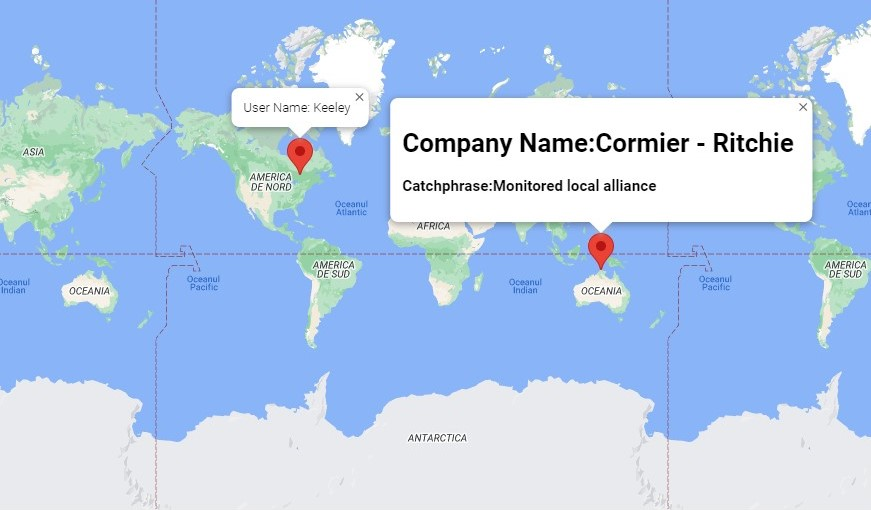

# GoogleMaps-Locator

## Google Maps Locator for users and companies (developed in Typescript)

### (This small application was created for practicing Typescript Design Patterns)

This app randomly generates Company Locations and User Locations using the "Faker" module and pins them on a GoogleMap instance.
The details of the generated pins can be shown (inside the pop-up window) by clicking them.

